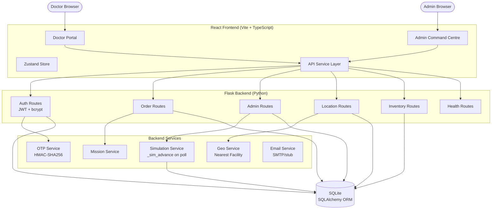
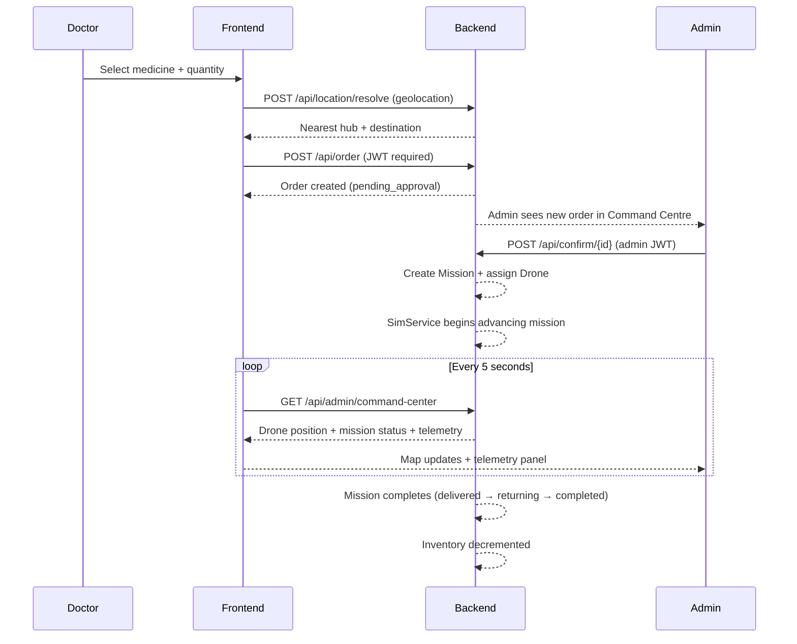

<div align="center">

# 🚁 MediHawk

### Autonomous Medical Drone Delivery Platform

*Real-time command control for life-critical medical logistics*

---


---

**MediHawk** is a full-stack drone delivery management platform built for the Smart India Hackathon 2026. It orchestrates the end-to-end flow of emergency medical cargo — from a doctor placing an urgent order, through admin approval and mission creation, to real-time simulation of an autonomous drone delivering medicine to the destination.

</div>

---

## The Problem

Emergency medicine delivery in remote and semi-urban areas depends on road infrastructure that may be unavailable, slow, or unsafe. When a hospital needs blood, insulin, antivenom, or emergency surgical supplies within minutes, road-based logistics fails.

## The Solution

MediHawk connects hospitals and healthcare facilities through a command-and-control platform that:

- Gives **doctors** a clean interface to place priority-coded medical supply orders
- Gives **admins** a mission control centre with live fleet tracking and telemetry
- Simulates **autonomous drone delivery** with real-time route visualization, ETA tracking, and multi-drone parallel missions
- Provides a **production-ready architecture** designed for future integration with physical Pixhawk/MAVLink drones

---

## 🚁 Live Mission Simulation

> **Software simulation mode** — no physical drone hardware required. All drone movement is driven by backend mission data with client-side position interpolation.

The Command Centre map renders every active drone in real time:

| Feature | Detail |
|---------|--------|
| Multi-drone | One simulated drone per active mission |
| Route | Hub → Destination polyline per mission |
| Position | Backend coordinates interpolated at 100ms on client |
| Heading | Icon rotates toward destination (real `atan2` bearing) |
| Trail | Last 60 positions rendered as fading flight trail |
| Drone icon | SVG quadcopter with medical cross — no external images |
| Popup | Speed · Altitude · Battery · ETA · Mission ID |
| Hub marker | Origin facility with cross icon |
| Destination | Amber location pin per mission |

The simulation service in `backend/services/simulation_service.py` advances all missions on every admin API poll, computing elapsed time, phase transitions (`preparing → in_flight → landing → delivered → returning → completed`), and drone telemetry.

**Physical Pixhawk/MAVLink hardware is not enabled in simulation mode.** The `_require_live_mode()` safety gate in `DroneService` blocks all real hardware commands unless `APP_MODE=live`.

---

## Architecture



---

## Order Workflow



---

## Feature Matrix

| Feature | Status |
|---------|--------|
| Doctor registration + login | ✅ Implemented |
| Admin registration (invite-code) | ✅ Implemented |
| OTP email verification | ✅ Implemented (SMTP configurable) |
| Forgot password / reset flow | ✅ Implemented |
| JWT authentication (role from DB) | ✅ Implemented |
| Browser geolocation → nearest hub | ✅ Implemented |
| Medicine inventory management | ✅ Implemented |
| Order creation + lifecycle | ✅ Implemented |
| Priority-coded orders (standard/urgent/critical) | ✅ Implemented |
| Admin order approval / rejection | ✅ Implemented |
| Mission creation on approval | ✅ Implemented |
| Admin Command Centre dashboard | ✅ Implemented |
| Multi-drone live simulation map | ✅ Implemented |
| Real-time drone position interpolation | ✅ Implemented (100ms) |
| Flight trail + heading rotation | ✅ Implemented |
| ETA + telemetry display | ✅ Implemented |
| Admin analytics dashboard | ✅ Implemented |
| Admin inventory management | ✅ Implemented |
| Admin location management | ✅ Implemented |
| Fleet readiness dashboard | ✅ Implemented |
| Alerts system | ✅ Implemented |
| WebSocket real-time push | 🔷 Architecture prepared (stub) |
| Physical Pixhawk/MAVLink integration | 🔶 Planned (Phase 2) |
| SMS OTP via Twilio | 🔶 Planned (Phase 1F) |
| Weather-aware routing | 🔶 Planned |
| Cold-chain temperature telemetry | 🔶 Planned |

✅ Implemented &nbsp;&nbsp; 🔷 Architecture prepared &nbsp;&nbsp; 🔶 Planned / Future

---

## Tech Stack

### Frontend
| | |
|---|---|
| **Framework** | React 19 + TypeScript 6 |
| **Build** | Vite 8 |
| **State** | Zustand 5 |
| **Routing** | React Router 7 |
| **Map** | Leaflet 1.9 + React-Leaflet 5 |
| **Charts** | Recharts 3 |
| **Animations** | Framer Motion 13 |
| **3D** | React Three Fiber + Three.js |
| **Styling** | Tailwind CSS 3 |
| **Icons** | Lucide React |

### Backend
| | |
|---|---|
| **Framework** | Flask 3.1 |
| **ORM** | SQLAlchemy 3 (Flask-SQLAlchemy) |
| **Database** | SQLite (production-upgradeable to PostgreSQL) |
| **Auth** | PyJWT 2 + bcrypt 4 |
| **CORS** | Flask-CORS |
| **Email** | SMTP (smtplib, configurable) |
| **Config** | python-dotenv |
| **Testing** | pytest + pytest-flask |

---

## Project Structure

```
MediHawk3/
├── backend/                    # Flask Python backend
│   ├── routes/                 # API blueprints
│   │   ├── auth.py             # Auth: login, signup, OTP, password reset
│   │   ├── admin.py            # Admin: command-centre, fleet, missions
│   │   ├── order.py            # Doctor: order lifecycle
│   │   ├── inventory.py        # Inventory CRUD
│   │   ├── location.py         # Geo resolution
│   │   └── health.py           # GET / and GET /api/health
│   ├── models/                 # SQLAlchemy models
│   ├── services/               # Business logic
│   │   ├── simulation_service.py   # Mission/drone simulation engine
│   │   ├── otp_service.py          # HMAC-SHA256 OTP
│   │   ├── mission_service.py      # Mission lifecycle
│   │   └── ...
│   ├── middleware/             # JWT auth decorators
│   ├── migrations/             # Schema migrations (applied on startup)
│   ├── tests/                  # 425 pytest tests
│   ├── config.py               # Environment-based configuration
│   ├── app.py                  # Application factory
│   ├── run.py                  # Development entry point
│   └── requirements.txt
├── src/                        # React TypeScript frontend
│   ├── components/             # UI components
│   │   ├── map/MissionMap.tsx  # Live drone map
│   │   └── ui/                 # StatusBadge, cards, charts
│   ├── pages/
│   │   ├── admin/              # Admin Command Centre, Orders, Analytics
│   │   └── doctor/             # Doctor dashboard, order flow
│   ├── hooks/
│   │   └── useAdminData.ts     # 5-second backend polling + store sync
│   ├── services/api/           # Typed API client
│   ├── store/index.ts          # Zustand global state
│   └── types/index.ts          # TypeScript type definitions
├── deployment/
│   ├── gunicorn.conf.py        # Production WSGI configuration
│   └── nginx.conf              # Reverse-proxy configuration
├── docs/
│   └── images/                 # Screenshots and diagrams
├── public/                     # Static assets
├── Dockerfile                  # Production container build
├── docker-compose.yml          # Compose deployment
├── package.json
└── backend/.env.example        # Environment variable template
```

---

## Installation

### Prerequisites

- Node.js 22+
- Python 3.11+
- Git

### Clone

```bash
git clone https://github.com/your-org/MediHawk3.git
cd MediHawk3
```

### Frontend

```bash
npm install
```

### Backend

```bash
cd backend
python3 -m venv venv
source venv/bin/activate          # Windows: venv\Scripts\activate
pip install -r requirements.txt
```

### Environment

```bash
cp backend/.env.example backend/.env
# Edit backend/.env — set SECRET_KEY, JWT_SECRET_KEY, OTP_HMAC_SECRET at minimum
```

### Database initialization

The database is auto-initialized on first startup. To seed demo data:

```bash
cd backend
source venv/bin/activate
python3 seed.py
```

---

## Local Development

**Terminal 1 — Backend:**
```bash
cd MediHawk3/backend
source venv/bin/activate
python3 run.py
# → http://localhost:5000
```

**Terminal 2 — Frontend:**
```bash
cd MediHawk3
npm run dev
# → http://localhost:5173
```

Open [http://localhost:5173](http://localhost:5173)

---

## Simulation Mode

MediHawk ships with `APP_MODE=simulation` — no physical drone hardware required.

```bash
# backend/.env
APP_MODE=simulation
```

In simulation mode:
- The backend simulation engine advances all active missions on every Command Centre poll
- Drone positions, telemetry, battery, and status update automatically
- The frontend map interpolates drone positions at 100ms between 5-second polls
- All MAVLink/Pixhawk hardware commands are blocked at the service layer

### Demo Flow for Judges

1. **Start both servers** (see Local Development above)
2. **Register as Doctor** → `/signup`
3. **Verify OTP** (check SMTP logs or leave SMTP unconfigured to skip in dev)
4. **Log in as Doctor** → place an order: select medicine, allow location, confirm
5. **Log in as Admin** (use seeded admin credentials or register with `ADMIN_INVITE_CODE`)
6. **Open Command Centre** → `/admin` — observe incoming order
7. **Confirm the order** → a mission is created and the drone appears on the map
8. **Watch the map** — the simulated drone moves along the route with live telemetry
9. **Track analytics** → `/admin/analytics` updates as orders complete

---

## API Reference

All API endpoints are prefixed `/api/`. Authentication uses `Authorization: Bearer <JWT>`.

### Health

| Method | Endpoint | Auth | Description |
|--------|----------|------|-------------|
| `GET` | `/` | None | Service info (HTTP 200) |
| `GET` | `/api/health` | None | Health check — database connectivity |

### Authentication

| Method | Endpoint | Auth | Description |
|--------|----------|------|-------------|
| `POST` | `/api/login` | None | Email + password → JWT |
| `POST` | `/api/logout` | Bearer | Invalidate session |
| `GET` | `/api/verify-token` | Bearer | Validate JWT |
| `POST` | `/api/auth/doctor/signup` | None | Doctor registration |
| `POST` | `/api/auth/admin/signup` | None | Admin registration (invite code required) |
| `POST` | `/api/auth/otp/request` | None | Request OTP for email verification |
| `POST` | `/api/auth/otp/verify` | None | Verify OTP |
| `POST` | `/api/auth/forgot-password/request` | None | Send password reset OTP |
| `POST` | `/api/auth/forgot-password/verify` | None | Reset password with OTP |

### Orders (Doctor)

| Method | Endpoint | Auth | Description |
|--------|----------|------|-------------|
| `POST` | `/api/order` | Doctor JWT | Create order |
| `GET` | `/api/orders` | Doctor JWT | List own orders |
| `GET` | `/api/order/<id>` | Doctor JWT | Single order detail |
| `POST` | `/api/cancel/<id>` | Doctor JWT | Cancel pending order |

### Inventory & Location

| Method | Endpoint | Auth | Description |
|--------|----------|------|-------------|
| `GET` | `/api/inventory` | Bearer | List inventory |
| `GET` | `/api/inventory/<id>` | Bearer | Single item |
| `POST` | `/api/location/resolve` | Bearer | Resolve coordinates → nearest hub |

### Admin

| Method | Endpoint | Auth | Description |
|--------|----------|------|-------------|
| `GET` | `/api/admin/command-center` | Admin JWT | Dashboard: drones, missions, alerts — also advances simulation |
| `GET` | `/api/admin/fleet` | Admin JWT | All drones |
| `GET` | `/api/admin/missions` | Admin JWT | All missions |
| `GET` | `/api/admin/missions/active` | Admin JWT | Active missions only |
| `GET` | `/api/admin/orders` | Admin JWT | All orders |
| `POST` | `/api/confirm/<id>` | Admin JWT | Approve order → create mission |
| `GET` | `/api/admin/analytics` | Admin JWT | Delivery analytics |
| `GET` | `/api/admin/locations` | Admin JWT | All locations |
| `GET` | `/api/admin/telemetry/<drone_id>` | Admin JWT | Drone telemetry history |
| `POST` | `/api/admin/drone/<id>/rtl` | Admin JWT | Return-to-launch (simulation state update) |
| `POST` | `/api/admin/drone/<id>/hold` | Admin JWT | Hold (connection degraded) |
| `POST` | `/api/admin/drone/<id>/resume` | Admin JWT | Resume normal operations |

---

## 🔐 Security

| Control | Implementation |
|---------|---------------|
| **Password hashing** | bcrypt (adaptive cost factor) |
| **Authentication** | JWT signed with `JWT_SECRET_KEY` — expiry configurable |
| **Role enforcement** | Role read from DB via JWT `sub` claim — never from request body |
| **OTP** | HMAC-SHA256 keyed hash — never stored in plaintext |
| **OTP protection** | Expiry · attempt limits · resend cooldown · rate limiting · single-use · purpose binding |
| **Admin onboarding** | Invite code required — empty string disables self-registration |
| **Password reset** | Signed short-lived token; consumed on use |
| **CORS** | Restricted to configured origins — `*` never used in production |
| **FK enforcement** | SQLite `PRAGMA foreign_keys=ON` on every connection |
| **Secrets in env** | All secrets via environment variables — `ProductionConfig` raises `RuntimeError` if unset |
| **Hardware gate** | `_require_live_mode()` blocks all MAVLink commands unless `APP_MODE=live` |
| **Logging** | Logging config explicitly prohibits logging passwords, JWTs, OTPs |

---

## Testing

### Backend

```bash
cd backend
source venv/bin/activate
pytest -q
```

**Result (verified):** `425 passed, 11 warnings`

Tests cover: authentication, OTP, password reset, order lifecycle, inventory, location resolution, admin endpoints, simulation, CORS, error handling, and security edge cases.

### Frontend

```bash
# TypeScript strict check
npx tsc --noEmit
# → 0 errors

# Production build
npm run build
# → ✓ built
```

---

## 🚀 Production Deployment

### Option A — Docker (recommended)

```bash
# 1. Set production environment variables
cp backend/.env.example .env.prod
# Edit .env.prod with strong secrets

# 2. Build and start
docker compose --env-file .env.prod up --build -d

# 3. Verify health
curl http://localhost:5000/api/health
```

### Option B — Manual (VPS / bare-metal)

**1. Build frontend:**
```bash
npm run build
# Generated in dist/
```

**2. Deploy backend with Gunicorn:**
```bash
cd backend
source venv/bin/activate
pip install gunicorn
gunicorn -c ../deployment/gunicorn.conf.py run:app
```

**3. Serve frontend with Nginx:**
Copy `dist/` to `/var/www/medihawk/dist` and install `deployment/nginx.conf`.

**4. TLS:**
```bash
certbot --nginx -d YOUR-PRODUCTION-DOMAIN
```

### Environment Variables (required in production)

| Variable | Required | Description |
|----------|----------|-------------|
| `SECRET_KEY` | **Required** | Flask session secret (random, 32+ chars) |
| `JWT_SECRET_KEY` | **Required** | JWT signing secret (random, 32+ chars) |
| `OTP_HMAC_SECRET` | **Required** | HMAC key for OTP hashing (random, 32+ chars) |
| `FLASK_ENV` | Optional | `production` (default) |
| `CORS_ORIGINS` | **Required** | `https://YOUR-PRODUCTION-DOMAIN` |
| `APP_MODE` | Optional | `simulation` (default) |
| `ADMIN_INVITE_CODE` | Recommended | Required for admin registration |
| `SMTP_*` | Recommended | Email delivery for OTP |

---

## Roadmap

### Current (Software Simulation)

- Full order lifecycle
- Admin command centre
- Multi-drone software simulation
- JWT authentication with OTP
- Inventory management
- Analytics

### Phase 2 — Hardware Integration (Planned)

- Pixhawk flight controller integration via MAVProxy
- Real drone telemetry over MAVLink
- Physical GPS position tracking
- Automated takeoff and landing sequences
- Geofencing and obstacle avoidance

### Phase 3 — Scale & Safety (Planned)

- DGCA regulatory compliance documentation
- Cold-chain payload temperature telemetry
- SMS OTP (Twilio) for areas without email
- Weather-aware routing via OpenWeather API
- Multi-hub fleet coordination
- WebSocket real-time push (Flask-SocketIO)

---

## Team

| | |
|---|---|
| **Project** | MediHawk — Autonomous Medical Drone Delivery Platform |
| **Team** | Team MediHawk |
| **Institution** | Einstein Academy of Technology and Management |
| **University** | BPUT (Biju Patnaik University of Technology) |
| **Competition** | Smart India Hackathon 2026 |
| **Problem Statement** | SIH26217 |

---

## License

Licensing information not yet specified. All rights reserved by Team MediHawk and Einstein Academy of Technology and Management.

---

<div align="center">

**MediHawk** — *Delivering medicine at the speed of flight.*

</div>
